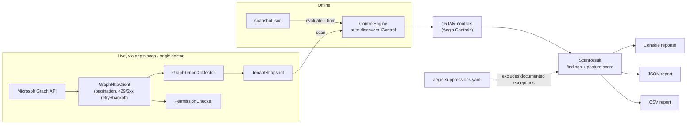

# Aegis-ID

[](https://github.com/SaniAdamou14/Aegis-ID/actions/workflows/ci.yml)

**Aegis-ID audits Microsoft Entra ID tenants for identity misconfigurations, read-only, and scores the result in under two minutes.**

> Demo GIF: not yet recorded — see [Known limitations](#known-limitations).
> In the meantime, `aegis demo` (below) reproduces the exact same output
> against a synthetic tenant, no credentials needed.

## The 15 controls (v1)

| ID | Title | Severity | CIS M365 | MITRE ATT&CK |
|---|---|---|---|---|
| [IAM-001](docs/controls/IAM-001.md) | Privileged accounts without strong MFA registered | Critical | 1.1.1 | T1078.004 |
| [IAM-002](docs/controls/IAM-002.md) | Privileged roles assigned permanently instead of PIM-eligible | High | 1.1.3 | T1098.003 |
| [IAM-003](docs/controls/IAM-003.md) | Global Administrator count outside the 2-4 range | High | 1.1.1 | T1078.004 |
| [IAM-004](docs/controls/IAM-004.md) | Missing or non-compliant break-glass account | High | 1.1.2 | T1078.004 |
| [IAM-005](docs/controls/IAM-005.md) | Application secrets/certificates expiring soon or without expiration | High | 1.2.1 | T1552.001 |
| [IAM-006](docs/controls/IAM-006.md) | Applications holding high-risk Microsoft Graph permissions | Critical | 2.1.1 | T1098.001 |
| [IAM-007](docs/controls/IAM-007.md) | User consent to applications is unrestricted | High | 5.1.5 | T1528 |
| [IAM-008](docs/controls/IAM-008.md) | Service principals with no sign-in activity for over 90 days | Medium | — | T1078.004 |
| [IAM-009](docs/controls/IAM-009.md) | Legacy authentication not blocked by an active Conditional Access policy | Critical | 1.2.2 | T1110.003 |
| [IAM-010](docs/controls/IAM-010.md) | Conditional Access policies in report-only mode or disabled | Medium | 1.2.x | T1562.001 |
| [IAM-011](docs/controls/IAM-011.md) | Permanent user or group exclusions in Conditional Access policies | High | 1.2.x | T1562.001 |
| [IAM-012](docs/controls/IAM-012.md) | Application registration allowed for all users | Medium | 5.1.2 | T1098.001 |
| [IAM-013](docs/controls/IAM-013.md) | Guest accounts holding a directory role | High | 5.1.6 | T1078.004 |
| [IAM-014](docs/controls/IAM-014.md) | Guest invitations allowed for all members | Medium | 5.1.6 | T1136.003 |
| [IAM-015](docs/controls/IAM-015.md) | Active user accounts with no sign-in for over 90 days | Medium | 1.1.4 | T1078.004 |

Each finding cites the object, the evidence observed, the risk, numbered
remediation steps, and these CIS/MITRE references. A control with no finding
is reported explicitly as `Passed` — absence of a finding is visible, not
silent.

## Installation

No published release yet (binaries ship from `.github/workflows/release.yml`
on the first tagged version). Until then, build from source — the only
prerequisite is the [.NET 8 SDK](https://dotnet.microsoft.com/download) (the
exact version is pinned in `global.json`):

```bash
git clone https://github.com/SaniAdamou14/Aegis-ID.git
cd Aegis-ID
dotnet build AegisId.sln
```

## Quickstart (three commands)

```bash
dotnet build AegisId.sln
dotnet test
dotnet run --project src/Aegis.Cli -- demo
```

The third command evaluates a synthetic, deliberately misconfigured tenant
embedded in the CLI — no network call, no credentials, and it triggers at
least one finding per control. To point Aegis-ID at a real tenant instead,
see [Required permissions](#required-permissions) and
`docs/dev-tenant-setup.md`.

## Required permissions

Aegis-ID's non-negotiable design principle: **it never requests a Microsoft
Graph write scope.** It reads, correlates, and reports — it modifies
nothing, deletes nothing, creates nothing. The app registration needs
exactly these six **application** permissions, all `.Read`:

- `Directory.Read.All`
- `Policy.Read.All`
- `AuditLog.Read.All`
- `Application.Read.All`
- `RoleManagement.Read.Directory`
- `UserAuthenticationMethod.Read.All`

Run `aegis doctor --tenant-id <id> --client-id <id>` before a scan to check
which of the six are granted, and to get a warning if a write scope was
granted to the app by mistake. See `docs/dev-tenant-setup.md` for the full
app registration walkthrough.

## Architecture



| Project | Responsibility | Depends on |
|---|---|---|
| `Aegis.Domain` | Core model (`TenantSnapshot`, `Finding`, `ControlEngine`, scoring). Zero external dependencies. | — |
| `Aegis.Controls` | The 15 `IControl` implementations (business rules). | `Aegis.Domain` |
| `Aegis.Graph` | Live Microsoft Graph collection: auth, pagination, retry/backoff, permission check. | `Aegis.Domain` |
| `Aegis.Cli` | Commands (`demo`, `evaluate`, `doctor`, `scan`), console/JSON/CSV reporters, suppressions. | all of the above |

A control is a class implementing `IControl` — dropping a new one into
`Aegis.Controls` is enough; `ControlEngine.DiscoverFrom` finds it by
reflection, no registration step.

## Known limitations

- **No demo GIF yet.** `aegis demo` reproduces the same output live, in
  seconds, with no setup.
- **Live collection has not been validated end-to-end against a real
  tenant.** `src/Aegis.Graph` is unit-tested against fixture HTTP responses
  and its flags/pagination/retry logic are exercised there, but nobody has
  yet pointed `aegis scan` at an actual Microsoft 365 Developer tenant. See
  `docs/dev-tenant-setup.md`.
- **IAM-002** (standing vs. PIM-eligible role assignment) is not yet
  populated by the live collector — see `docs/controls/IAM-002.md`.
- **Break-glass detection has no Graph-side signal.** There is no tenant
  property meaning "this is a break-glass account"; `IsBreakGlassAccount`
  is always `false` from a live scan today. A config file to let operators
  mark known break-glass UPNs is a natural follow-up (tracked informally,
  not yet a user story).
- **No Angular dashboard, history, or scan comparison yet** (Sprint 3/E7 of
  the backlog) — today Aegis-ID is CLI-only.
- **No coverage badge** — needs a third-party coverage service account, a
  purely CI-tooling gap unrelated to the product itself.
- Out of scope for v1 by design (not limitations, decisions — see
  `Aegis-ID_Product_Backlog.md` §6): automatic remediation, Exchange/
  SharePoint/Teams workload audits, Azure RBAC at the subscription/resource
  level, real-time alerting, multi-tenant scans in one run.

## Current state

- Domain model (`TenantSnapshot`, `Finding`, control engine, scoring) — done.
- All 15 v1 IAM controls implemented.
- CLI, offline (no network, no tenant needed):
  - `aegis demo` — synthetic embedded snapshot.
  - `aegis evaluate --from <snapshot.json> [--fail-on <Severity>]
    [--output console|json|csv] [--file <path>]
    [--suppressions <suppressions.yaml>] [--quiet] [--verbose]`
- CLI, live Microsoft Graph (client credentials flow, US-001/003/004):
  - `aegis doctor --tenant-id <id> --client-id <id> [--secret <secret>]` —
    reports which of the six required read-only permissions are granted,
    and warns if a write scope was granted by mistake.
  - `aegis scan --tenant-id <id> --client-id <id> [--secret <secret>]
    [--fail-on <Severity>] [--dump <snapshot.json>]
    [--output console|json|csv] [--file <path>]
    [--suppressions <suppressions.yaml>] [--quiet] [--verbose]` —
    collects a live tenant snapshot (paginated, retries on 429/5xx with
    backoff + jitter) and evaluates it with the same engine as `evaluate`.
  - Client secret: `--secret`, or the `AEGIS_CLIENT_SECRET` environment
    variable. Never logged, never printed.
- `--output json` writes a versioned JSON report (see `docs/report-schema.md`)
  and `--output csv` writes one row per finding — both require `--file
  <path>`. `--fail-on <Severity>` returns exit code `1` if a finding at or
  above that severity exists, `0` otherwise; exit code `2` is reserved for
  execution errors.
- `--suppressions <file.yaml>` documents accepted exceptions for specific
  findings without hiding them from the report — see `docs/suppressions.md`.
- `--quiet` limits console output to the score and severity counts;
  `--verbose` adds per-control durations (and, for `scan`, each Graph HTTP
  call).

See `Aegis-ID_Product_Backlog.md` for the full product backlog and
`docs/threat-model.md` for the threat model.

## Continuous integration & releases

Every push and pull request runs `.github/workflows/ci.yml`: restore, build
with warnings as errors, `dotnet format --verify-no-changes`, the full test
suite, and a [gitleaks](https://github.com/gitleaks/gitleaks) secret scan.
A tagged push (`vX.Y.Z`) runs `.github/workflows/release.yml`, which
publishes self-contained single-file binaries for Linux, Windows, and macOS
to the GitHub release, and a container image to
`ghcr.io/saniadamou14/aegis-id`.

A branch ruleset on `master` requires the `build-and-test` and `gitleaks`
checks to pass before a push or merge is accepted — changes land through
pull requests. See `CONTRIBUTING.md` for the full contributor workflow.
